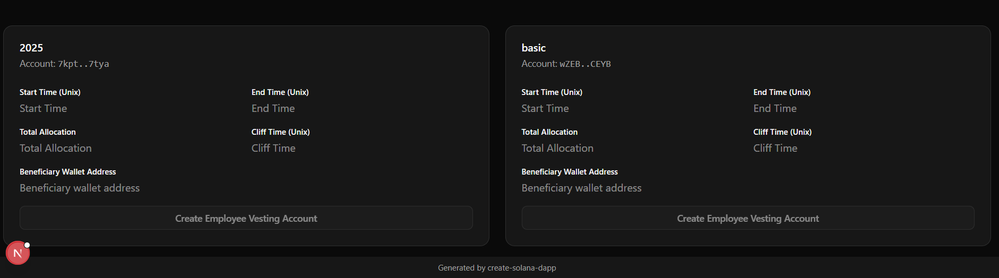

# Token Vesting Program on Solana

## Overview

The Token Vesting Program on Solana enables the gradual release of tokens to beneficiaries over a defined period, supporting customizable vesting schedules and optional cliff periods. Built with Rust and the Anchor framework, this program ensures secure and efficient token management on the Solana blockchain.

## Program Deployment

- **Program ID (devnet):** `6Q5NBNNJNukLLYqdMKtM6nv359wSXQ1h1HRk67mS1jMW`
- **Deployment Signature:** `5CpAprpicQXdmXk8RtQMcsp9bb93bwJfedncXzibLsAJBXBBdgmcRFdgMdZQSDBWbK8wG5o796hH1FnchFUC3HF`


Repository: [github.com/abhilov23/tokenvesting](https://github.com/abhilov23/tokenvesting)

---

## Features

- **Customizable Vesting Schedules:** Set up linear vesting with optional cliff periods.
- **Revocable Vesting:** Contract owners can revoke vesting schedules if configured.
- **Multiple Beneficiaries:** Supports vesting schedules for multiple users.
- **Secure Token Management:** Leverages Solana's token program for safe transfers.
- **Audit-Ready:** Follows best practices for secure smart contract development.

---

## Installation

1. **Clone the Repository:**
     ```sh
     git clone https://github.com/abhilov23/tokenvesting.git
     cd tokenvesting
     ```

2. **Install Dependencies:**
     ```sh
     yarn install
     ```

3. **Build the Program:**
     ```sh
     anchor build
     ```

4. **Configure Solana Network:**
     Set up Solana CLI for a local or devnet cluster:
     ```sh
     solana config set --url https://api.devnet.solana.com
     ```

---


## Usage

- **Create a Vesting Schedule:** Initialize a vesting schedule with a beneficiary, token mint, start time, cliff, duration, and amount.
- **Release Tokens:** Beneficiaries can claim vested tokens after the cliff period.
- **Revoke Vesting:** Owners can revoke vesting schedules if enabled.

---

## Images





**Possible reasons images are not showing:**
- The image files do not exist at the specified paths (`images/Screenshot 2025-06-30 153717.png` and `images/image.png`).
- There may be a typo in the file names or extensions (check for spaces, capitalization, or missing files).
- The images folder is not in the same directory as your README.md file.
- If viewing on GitHub, spaces in filenames should be URL-encoded as `%20`, but most markdown renderers handle this automatically.
- If viewing locally, ensure your markdown viewer supports relative image paths.

**To fix:**
- Verify the images exist at `./images/` relative to your README.md.
- Double-check file names and extensions.
- Try renaming files to avoid spaces or special characters.
- If issues persist, use absolute URLs or upload images directly to your repository.


## Contributing

Contributions are welcome! Please open an issue or submit a pull request on [GitHub](https://github.com/abhilov23/tokenvesting).

---

## License

This project is licensed under the MIT License. See the [LICENSE](LICENSE) file for details.